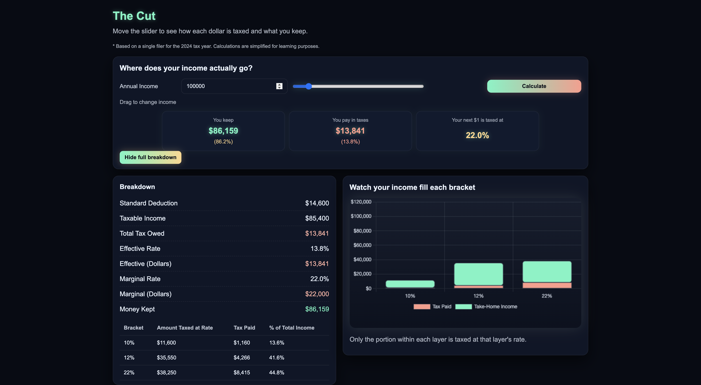

# The Cut

**Built to show what’s really happening before your paycheck hits your pocket.**

## Overview
The Cut is a web app that shows what really happens to your income — how it’s taxed, how much you keep, and how each tax bracket actually works.  
It’s meant to make the numbers make sense by turning complex tax math into something visual, interactive, and easy to understand.

This version covers **Single Filers for the 2024 tax year**. Other filing statuses like Married or Head of Household will come later as the project expands.

[View Project](https://thecut-demoday-proj-production.up.railway.app/)

### Problem & Goal
Most people can tell you what they make but not what they truly keep — or how much of it goes where.  
The goal of The Cut is to make that clear. It’s a visual tool for financial literacy, designed to help people actually see how the federal tax system slices up income and where their money lands.

---

## How It’s Made
Built with:
- **Node.js** for the backend (`http`, `fs`, `url`, `querystring`)
- **JavaScript**, **HTML**, and **CSS** for the frontend
- **Chart.js** for live stacked bar visuals  

Everything is hand-coded for simplicity and structure. No frameworks — just clean logic, readable files, and direct control over how the math connects to the visuals.

---

## How It Works
1. The user enters their annual income or adjusts the **slider**.  
2. The backend calculates:
   - Standard deduction  
   - Taxable income  
   - Total tax owed  
   - Effective and marginal tax rates  
3. The frontend:
   - Updates the breakdown instantly  
   - Shows what’s taxed and what’s kept  
   - Renders a glowing stacked bar chart that reacts to each change  
   - Displays tooltips that explain what each bracket means in plain language  

---

## Optimizations
- Tightened Chart.js layout to stop graph clipping on smaller screens  
- Locked horizontal scroll and fixed width overflow issues  
- Added smooth scaling for both the graph and breakdown table  
- Refined tooltips to make the hover info more conversational and useful  
- Simplified math and cleaned naming for clarity  
- Smoothed out layout so it feels balanced across devices  

---

## Lessons Learned
- Real clarity comes from visuals, not just explanations  
- People understand money better when they can *see* where it goes  
- Keeping the codebase light makes every adjustment faster  
- Designing for both accuracy and readability matters just as much as the math  

---

**Built to show what’s really happening before your paycheck hits your pocket.**